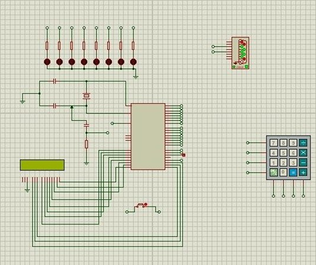
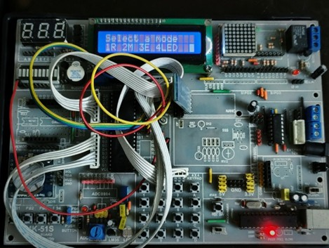
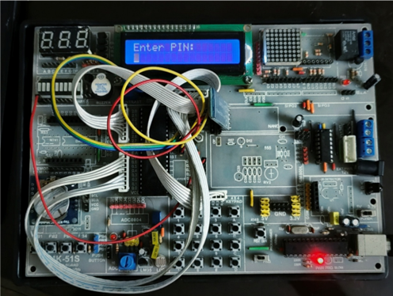

# 8051-Bluetooth-Smart-Control-System
# Home Automation System using Arduino

## Proteus Simulation

The following image shows the complete Proteus circuit simulation of the embedded home automation system.

---

## Mode Selection Interface

This image demonstrates the system interface used for selecting different modes of operation.

---

## Hardware Password Protection Setup

The following hardware prototype implements password-protected access and embedded control functionality.

